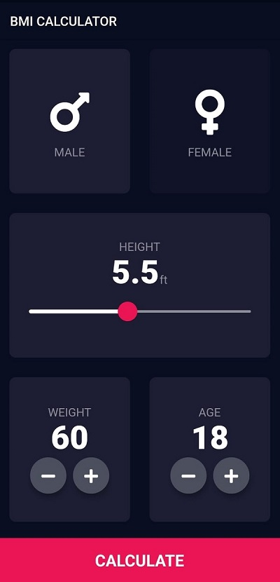

# **BMI Calculator Flutter App**

## **Overview**

The **BMI Calculator Flutter App** is a user-friendly application designed to help individuals determine their Body Mass Index (BMI) and assess whether they are within a healthy weight range. Built using Flutter, the app is optimized for both Android and iOS platforms.

---

## **Features**

- 🧮 **BMI Calculation**: Easily calculate BMI based on height and weight inputs.
- 📊 **Health Insights**: Provides feedback on whether you are underweight, normal weight, overweight, or obese.
- 🎨 **Modern UI Design**: Sleek and intuitive interface for an enhanced user experience.
- 🚀 **Cross-Platform Compatibility**: Runs seamlessly on Android and iOS devices.

---

## **Technologies Used**

- **Flutter**: Framework for building natively compiled applications.
- **Dart**: Programming language for Flutter development.
- **Swift**: For iOS-specific integrations.
- **Kotlin**: For Android-specific integrations.

---

## **Installation**

### Prerequisites:

- Install [Flutter](https://flutter.dev/docs/get-started/install).
- Set up your [development environment](https://flutter.dev/docs/get-started/editor).

### Steps:

1. Clone the repository:
   ```bash
   git clone https://github.com/reetpriye/bmi-calculator-flutter.git
   ```
2. Navigate to the project directory:
   ```bash
   cd bmi-calculator-flutter
   ```
3. Fetch dependencies:
   ```bash
   flutter pub get
   ```
4. Run the app:
   ```bash
   flutter run
   ```

---

## **Contribution**

Contributions are welcome! Here’s how you can contribute:

1. Fork the repository.
2. Create a new branch:
   ```bash
   git checkout -b feature-name
   ```
3. Commit your changes:
   ```bash
   git commit -m "Add your feature description"
   ```
4. Push your branch:
   ```bash
   git push origin feature-name
   ```
5. Open a pull request.
